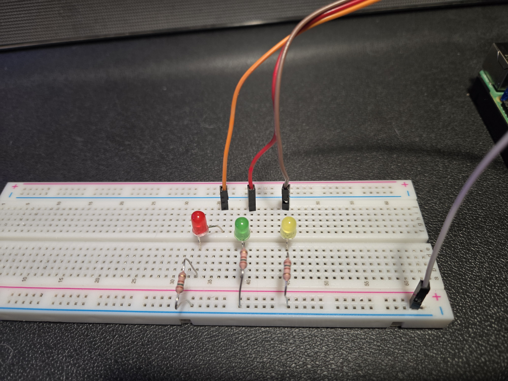
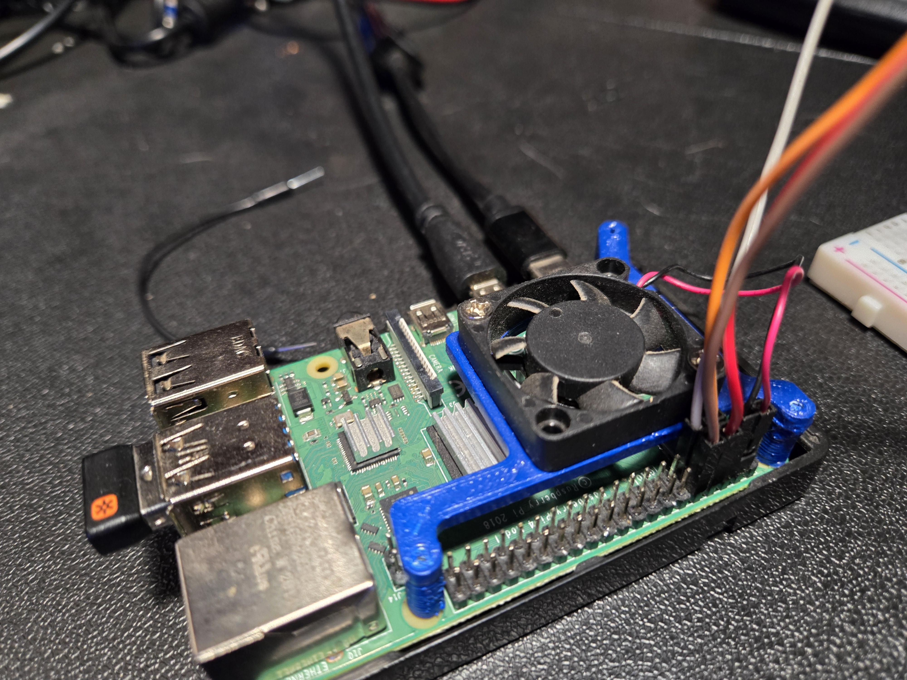

# Worlds Most Complicated Blinking LED Pi Project
---
Hello World! This project is to serve as a starting point for working with ROS2 Jazzy on a Raspberry Pi. It can be used a reference for building future projects.  Using ROS's basic Nodes (publishers, subscribers, servers, clients, actions) and custom interfaces, this must be one of the worlds most complex "Blinking LED" project.

[Short Video Demo](https://youtube.com/shorts/V9wCvEa0f0w?feature=share)


---
## **THINGS NEEDED**
- Raspberry (Pi 4 8gb min)
- High Speed microSD card
- Breadboard
- 4 Male to Female Jumper Wire
- 3 LED
- 3 Resistor
- PS4 Dualshock Controller
- PiCamera 2 (Added)

---
## **Setting Up The Pi**
- Install ubuntu 24.04 using Pi Imager on microS [Pi Imager Download](https://www.raspberrypi.com/software/)
- Hook the Pi up to a Keyboard, Mouse, Monitor
- Turn Pi on, and follow the setup process
- ```$ sudo apt update && sudo apt upgrade```
- Open Settings / Sharing
   - Activate Media Sharing
- In settings / System / Remote Desktop
   - Activate Desktop Sharing
   - Activate Remote Desktop
- **IMPORTANT** - Check now and make sure PS4 controlle connects to Pi
- Open Bluetooth settings
- ensure ps4 controller works - if not, reinstall 24.04 or install 22.04 then upgrade "sudo do-release-upgrade"
- ```$ sudo apt install openssh-server```
- Get IP address ```$ ip a``` and look to the "inet" that comes after BRODCAST
- On other pc test ```$ ping <ipAddress>``` -> ensures Pi is connected to wifi
- Install OpenSSH server ```$ sudo apt install openssh-server```
- Open a terminal on the working PC ```$ ssh <PiUsername>@<PiIPAdress>```
- - If you get an error tyrruning ```$ ssh-keygen -R {ipAddress)```
- Open VS Code / Click blue btn bottom left /
- - Connect to host / Configure SSH Hosts / C:Users/name/.ssh/config
- Add this to the file
```
Host <name-that-shows-in-VS-Code>
   HostName <Pi-Ip-Addres>
   User <Pi-Name>
```
- Click blue btn bottom left / Connect to host / name-that-shows-in-VS-Code
- - Type in Pis Passwords



---
## **Install Needed Libraries**
#### **PIPX, RPi.GPIO, pyPS4controller,git, ROS2 Jazzy**
- ```$ sudo apt install pipx``` -- Automatically creates venv / Works like normal pip
- ```$ sudo pipx install RPi.GPIO``` -- Use just like normal GPIO pins
- ```$ sudo pipx install pyPS4Controller``` -- [pyPS4Controller Docs](https://github.com/ArturSpirin/pyPS4Controller/)
- ```$ sudo apt install git-all``` -- This is just git, if you her, you know

---
## **Install ROS2 Jazzy**
The reason for using Ubuntu 24.04 is because this is the recomended O.S. for ROS2 Jazzy. Jazzy is the lastest version of ROS with long term support.

Installing ROS is rather simple, but there are a lot of commands needed to properly set it up.  The first link is the installation guide, just follow the steps, running every command.  At this point ROS would work fine, but it would be less than convenient.  Following the first link will be some additional commands and links with more information.
- [ROS2 Installation](https://github.com/ArturSpirin/pyPS4Controller/)
- Add the Workspace - ```$ echo "source ~/ros2_ws/install/setup.bash" >> ~/.bashrc```
- [Add ROS to .bashrc](https://docs.ros.org/en/jazzy/Tutorials/Beginner-CLI-Tools/Configuring-ROS2-Environment.html) - ```$ echo "source /opt/ros/jazzy/setup.bash" >> ~/.bashrc```
- [Install Colcon](https://docs.ros.org/en/jazzy/Tutorials/Beginner-Client-Libraries/Colcon-Tutorial.html) - ```$ sudo apt install python3-colcon-common-extensions```
- [Colcon AutoComplete](https://docs.ros.org/en/jazzy/Tutorials/Beginner-Client-Libraries/Colcon-Tutorial.html) - ```$ echo "source /usr/share/colcon_argcomplete/hook/colcon-argcomplete.bash" >> ~/.bashrc```



---
## **Give User Root Access to GPIO**
By default Ubuntu doesn't grant access of the GPIO pins to the User.  To give the User access, create a new member group for the GPIO, add the User, and restart apache2, in short.
1. ```$ sudo groupadd gpio```
2. ```$ sudo usermod -a -G gpio <<user_name>>```
3. ```$ sudo grep gpio /etc/group```
4. ```$ sudo chown root:gpio /dev/gpiomem```
5. ```$ sudo chmod g+rw /dev/gpiomem```
6. ```$ sudo service apache2 restart```

If you shutdown the Pi and on restart you lose access to the GPIO you need to run steps 2-5 to regain access.

---
## Set Up PiCam
Some Libraries may already be installed by default, but just running all these\
steps should eliminate any errors.\
```$ sudo apt install libraspberrypi-bin v4l-utils ros-jazzy-v4l2-camera```\
```$ sudo apt install ros-jazzy-image-transport-plugins```\
Next check to see if the user is a member of the video group.\
```$ groups```\
If video is not in the list:\
```$ sudo usermod -aG video <<username>>```\
```$ sudo reboot now```\
Install Raspi Config\
```$ sudo apt install raspi-config```\
Before opening the Config, be sure the terminal is large enough for a whole menu\
```$ sudo raspi-config```\
Using the arrow pad, navigate into the "4 Interface Options" section\
Inside there enable the Legacy, SPI, and I2C options\
Once done, exit the config menu and reboot when prompt or reboot manually


With the camera installed to check if its available\
```$ vcgencmd get_camera```\
output should be ```supported=1 detected=1, libcamera interfaces=0```\
Another test is one terminal run:\
```$ ros2 run v4l2_camera v4l2_camera_node --ros-args -p image_size:="[640,480]"```\
In a second terminal:\
```$ ros2 topic echo /image_raw```\
What will be returnd will be a series of a array 

Lastly to use the camera easily install OpenCV\
```$ sudo apt-get install python3-opencv```

---
To Launch project:
```$ ros2 launch timed_led main_launch._launch.xml```

***<h1 style="text-align:center;">Happy Coding!</h1>***
